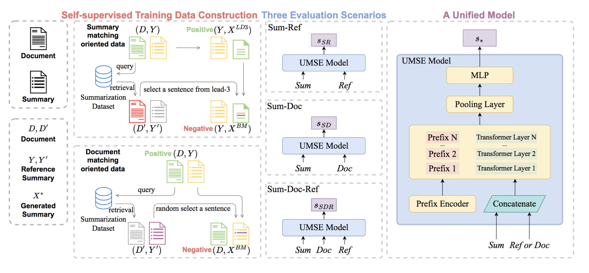

# UMSE
This is the repository for the ACL 2023 findings paper:
> UMSE: Unified Multi-scenario Summarization Evaluation

## Overview

The Unified Multi-scenario Summarization Evaluation Model (UMSE) is a unified multi-scenario summarization evaluation framework. UMSE can perform the semantic evaluation on three typical evaluation scenarios: (1) Sum-Ref; (2) Sum-Doc; (3) Sum-Doc-Ref.

To transfer knowledge between these scenarios, we propose a perturbed prefix-tuning method that unifies these different scenarios in one model. To train the UMSE in a self-supervised manner, we propose two training data construction methods without using any human annotation. 



## Installation

```bash
git clone https://github.com/ZT-Yao/UMSE.git
cd UMSE
pip install -r requirements.txt
```

## Training

You can download the training dataset for UMSE, which includes data focused on summary matching and document matching, from the [here](https://drive.google.com/file/d/1K_KXGPusrXz4Ywe3bpVTdw0Cif7jkGXS/view?usp=drive_link).

```bash
python train.py --cfg configs/models/regression_metric.yaml
```

## Testing

You can download the pre-trained UMSE model from the [Google Drive](https://drive.google.com/file/d/1k3Q7UXlRzyANGYFPmger37QOHzjDBzmy/view?usp=drive_link).

```bash
python score.py --data SummEval.jsonl --model UMSE.ckpt --config hparams.yaml --output output
```


## Reference

```
@inproceedings{Gao2023UMSE,
   title={UMSE: Unified Multi-scenario Summarization Evaluation},
   author={Shen Gao, Zhitao Yao, Chongyang Tao, Xiuying Chen, Pengjie Ren, Zhaochun Ren and Zhumin Chen},
   booktitle={Proceedings of the 61st Annual Meeting of the Association for Computational Linguistics},
   year={2023}
}
```

